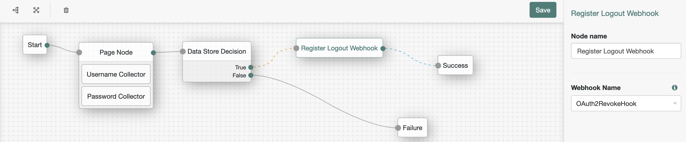
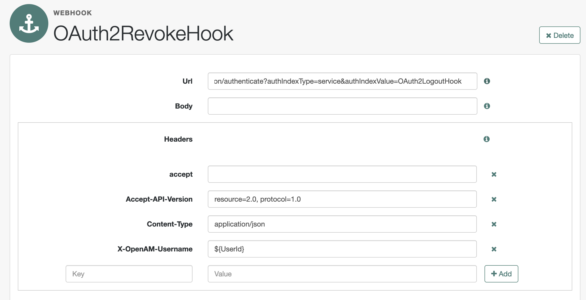
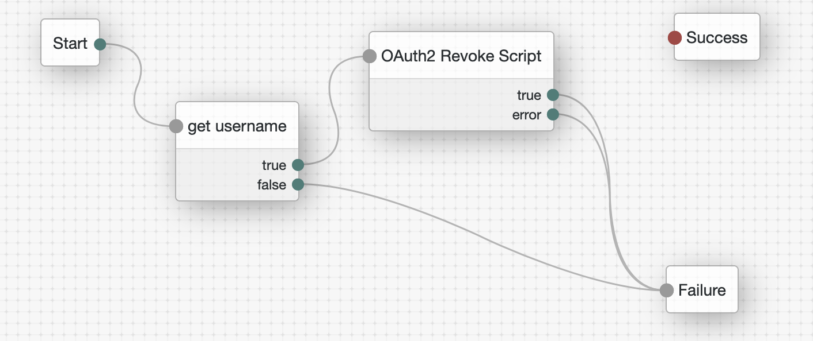

# OAuth2 revoke hook

## Introduction

JavaScript node revokes all OAuth2 tokens during Session logout.

## Limitations

- OAuth2 tokens are not bound to the session, so all OAuth2 tokens are revoked
- An Adminstrator (not necessarily amadmin) token is required during the logout 

## Contents

Example base AM tree



The Logout webhook node is configured to use the following hook:



You need to create another Journey that's going to be called by the above Logout Webhook, as below:




## Configuration

Create an AM scripted decision node using the node in the [src](src) directory

- oauth2-revoke-script.js

also another simple scripted node that gets the username from the Username header:

- get-username-from-header.js


## Testing 

Debug output:
```
ERROR: ******get-username-from-header node executing
ERROR: ******get-username-from-header UserId retrieved. Updating Tree state with username: demo
ERROR: ******OAuth2RevokeHook node executing
ERROR: ******OAuth2RevokeHook The user is demo
ERROR: ******OAuth2RevokeHook Authenticating as administrator
ERROR: ******OAuth2RevokeHook Returning admin token DtyAW0rZWTBLhSWDLrQ_9Mfw694.*AAJTSQACMDEAAlNLABw0QVBuTDN6Yys0UTFySUtQMjA0dEhNTlBHWVk9AAR0eXBlAANDVFMAAlMxAAA.*
ERROR: ******OAuth2RevokeHook Retrieving authorized clients
ERROR: ******OAuth2RevokeHook Calling: http://localhost:8080/openam/json/users/demo/oauth2/applications?_queryFilter=true with admin token DtyAW0rZWTBLhSWDLrQ_9Mfw694.*AAJTSQACMDEAAlNLABw0QVBuTDN6Yys0UTFySUtQMjA0dEhNTlBHWVk9AAR0eXBlAANDVFMAAlMxAAA.*
ERROR: ******OAuth2RevokeHook The response was: {"result":[{"_id":"myClientID2","_rev":"1707150355","name":null,"scopes":{"profile":"profile"},"expiryDateTime":null,"logoUri":null},{"_id":"myClientID","_rev":"-716037343","name":null,"scopes":{"profile":"profile"},"expiryDateTime":null,"logoUri":null}],"resultCount":2,"pagedResultsCookie":null,"totalPagedResultsPolicy":"NONE","totalPagedResults":-1,"remainingPagedResults":-1}
ERROR: ******OAuth2RevokeHook Got 200 OK. Authorized clients count: 2
ERROR: ******OAuth2RevokeHook Collect authorized clients.
ERROR: ******OAuth2RevokeHook Found authorized client myClientID2
ERROR: ******OAuth2RevokeHook Found authorized client myClientID
ERROR: ******OAuth2RevokeHook Returning authorized clients.
ERROR: ******OAuth2RevokeHook Revoking authorized clients
ERROR: ******OAuth2RevokeHook Attempting to delete tokens from client myClientID2
ERROR: ******OAuth2RevokeHook the client myClientID2 tokens have been revoked
ERROR: ******OAuth2RevokeHook Attempting to delete tokens from client myClientID
ERROR: ******OAuth2RevokeHook the client myClientID tokens have been revoked
ERROR: ******OAuth2RevokeHook OAuth2 Logout was successful
```
